# App Modernization with Azure App Services

## Overview

The **Azure App Service** is a service for hosting web applications, REST APIs and mobile backend. We can develop applications using .NET, .NET Core, Java, Ruby, Node.js, PHP or Python. The Applications will run and scale with ease on the Windows-based environments. For Linux-based environments, the web apps add the power of Microsoft Azure to the applications such as security, load balancing, auto scaling and automated management.

Azure makes it very easy to modernize our application portfolio. With Azure App Service, we can easily migrate our existing .NET applications with very minimal efforts. In this demo, we will showcase different scenarios for migrating an on-premise ASP.NET Web Forms based application to the Azure App Service.

## Key Takeaways

The key takeaways of this demo are:
* When migrating to the cloud, teams want to focus on development and DevOps improvements that increase productivity, agility, flexibility, and operational efficiency.
* Azure App Service allows team to easily migrate our existing .NET applications with very minimal efforts.

## Demo Scenario

This demo is based on SmartHotel360, which is a fictitious smart hospitality company. Due to the complexity of managing the local infrastructure, SmartHotel360 wants to re-host their web app with minimal efforts in Azure and take advantage of the Platform as a Service (PaaS).

There are 3 scenarios showcased here:
1. A simple web app running on local IIS connected to a local SQL Server database - In this scenario, we will be creating the resources in Azure, publish the website and the database.
1. A website with a WCF service dependency connected to SQL Server database - In this scenario, we will be publishing the website, the WCF service and the database. This WCF service uses basic HTTP binding without authentication.
1. A website with a WCF service dependency connected to SQL Server database - In this scenario, SmartHotel360 wants to re-host only the website and leave the WCF service, SQL Server running on-premises.


  

## Scenario 1 : Publish a simple web app and SQL database in Azure

There are various ways we can create and deploy the Azure resources for our app, i.e., we can create the resources in the Azure Portal or we can use Visual Studio. For this demo, we will use the Visual Studio Publishing Tool.

### Exercise 1: Getting Started

1. You will need **Visual Studio 2017 Community and/or Enterprise** (Snapshot Debugger).

2. Open the solution called **SmartHotel360.Registration**.
  
    >**Talk Track**: In this demonstration, we will look at the example of SmartHotel360, a fictitious hospitality company planning to use the Microsoft Azure App Service to re-host its web application to Azure.

### Exercise 2: Deploy to Azure

1. Right-click on the web project in the Visual Studio and select the **Publish** option.


    

    >**Talk Track**: We will cover three scenarios showing how we can migrate an on-premises ASP.NET Web Forms application to the Azure App Service. In the first scenario, the app is a simple web app running on a local IIS and is connected to a local SQL Server database.

1. Select the **App Service** on the left menu and click on the **Create New** option to create a new App Service. If an app service already exists and needs to be used, click the **Select Existing** option. Click the **Publish** button.


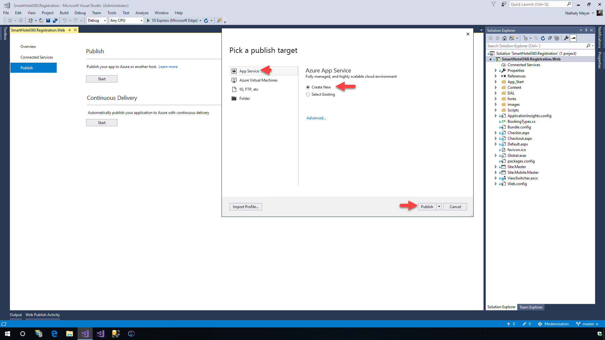
    

    >**Talk Track**: On the Publish screen, we have options to publish apps to local development environments, Azure VMs and App Service targets. We can choose an existing profile to publish, if we have already created the resources. Since we are publishing this app for the first time, we will need to create a new profile along with the Azure resources required to run the application.


1. Provide a name in the **App Name** field, select the **Azure subscription**, select or create a new **Resource Group** and then select or create a new **Hosting Plan**. Please see the resources tab for Azure credentials that you can use.

    The following information is used here-
    ```
    App Name: SmartHotel360Registration
    Subscription: Azure Hero Solutions Subscription
    Resource Group (New): SmartHotel360Registration
    Hosting Plan (New):
        - App Service Plan: SmartHotel360RegistrationPlan
        - Location: Central US
        - Size: S1 (Minimum Size)
    ```


    

1. Since this app connects to a database, click on the **Create a SQL Database** option,  create a new SQL Server and provide the credentials (username and password) for the SQL Server. Provide the **database name** and use the default name for the connection string **DefaultConnection**. Click on the **OK** button and then click on the **Create** option. This tool will connect to Azure and provision the resources required to publish the web project in the App Service.

    >**Talk Track**: In this demo, sample data generators are being used so that the blank database will be populated automatically when the website is loaded for the first time.


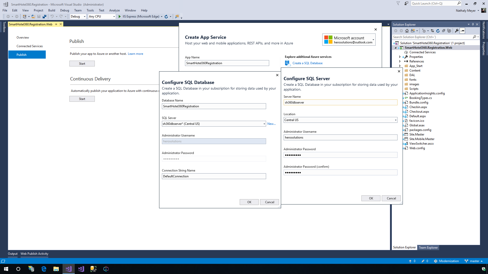
    

### Exercise 3: Exploring the Azure App Service

1. Once the app is deployed in the Azure App Service, the website will open automatically.


    

   > **Talk Track**: From the URL, we can see that the web app is now live and no longer running locally. Here, we can see information of the registered customers and the status whether they are checked-in or checked-out of the hotel.

1. Launch the **Microsoft Edge** browser to view the Azure portal homepage.

    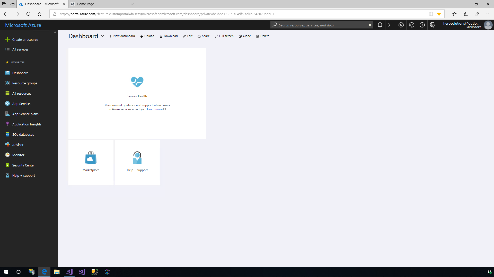


    

1. Open the **Resource Group** that was created from the Visual Studio Publishing Tool to see the created resources.


    

1. Select the App Service, in this case, it will be the App Service **SmartHotel360Registration**.

#### Global scale with high availability

1. Under the **Settings** option in the App Service menu, choose the **Scale Up (App Service Plan)** option to see the different tiers available for this App service.


    

    >**Talk Track**: One of the challenges is managing the infrastructure and setting up the scalability needed for our apps. Businesses should run without system failures, no matter how much they grow. With the App Services, we can scale up or down, manually or automatically. Our applications can be hosted anywhere in the Microsoft's global datacenter infrastructure and the App Service SLA promises high availability.

1. Select the **Scale Out (App Service Plan)** option in the left menu and click on the **Enable autoscale** option.  Provide an auto scale setting name and create a rule. In this scenario, use the default rule configured - If the CPU percentage is greater than 70%, add an additional instance. Click the **OK** button. We can define up to 10 maximum instances. Click on the **Save** button and our application is now set for auto scale.


    

    >**Talk Track**: With this feature, we can increase the number of VM instances that run our application. The number of instances we can have, depends on our pricing tier. Let us configure a new autoscaling profile.

    >**Talk Track**: Here, we will use the default rule which states that if the CPU percentage is greater than 70%, it will add an additional instance.

#### Security and compliance

   The Azure App Service is ISO, SOC and PCI compliant which is a requirement for App Modernization as it requires security and compliance. Create IP address restrictions, manage service identities, add custom domains and SSL for the apps. We can create restorable archive copies of our apps content, configuration and database.

1. Click on the **Authentication / Authorization** option to setup identity provider or anonymous access.


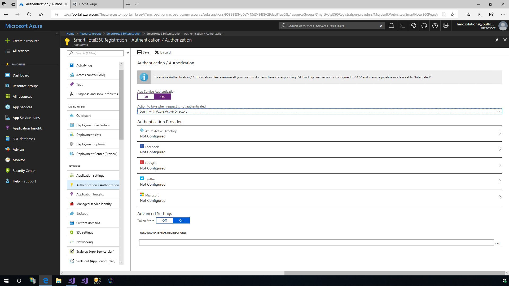
    

    >**Talk Track**: We can choose to authenticate users with the Azure Active Directory, or via other platforms such as Google, Facebook, Twitter and Microsoft.

1. Click on the **Backups** option to configure the Snapshot and Backup configuration.


    

    >**Talk Track**: Here we can take a snapshot of an OS or data disk VHD for backup or to troubleshoot VM issues. A snapshot is a full, read-only copy of a VHD. Here we can also backup and restore our data in Azure. Azure Backup replaces our existing on-premises or off-site backup solutions with a cloud-based solution which is reliable, secure and cost-competitive.

1. Click on the **SSL settings** option to setup the certificates and TLS.


    

    >**Talk Track**: Here we can configure the transport security layer (TLS), specify the certificates to be used when responding to requests to host a specific hostname over HTTPS and more.

#### DevOps optimization

Setting up a Continuous Integration and Continuous Deployment (CI/CD) with Visual Studio Team Services, GitHub, Bitbucket, Git, FTP, Dropbox or OneDrive has never been easier. The Azure App Services will setup the right configuration for our build definitions from the source control for our Azure App Service using the Build Provider.

1. We can also setup the CI/CD pipeline in Deployment options or Deployment Center. Here we can find multiple source controls and build providers.

   <p align="center">

    

### Exercise 4: Application Insights

Monitoring is a big part of App Modernization - understanding which features are the most used, which pages are the most visited or what is causing the most failures will help the development team to focus more on those elements. Application Insights is an extensible Application Performance Management (APM) service for web developers on multiple platforms. Use it to monitor the live web application. It will automatically detect performance anomalies. It includes powerful analytics tools to help us diagnose issues and to understand what users do with our apps.

1. To add Application Insights to our apps, we can either use the option in the left menu of the App Service or we can use Visual Studio. Just right-click on the web project and select the **Configure Application Insights** option.


    

    >**Talk Track**: Application Insights is an extensible Application Performance Management (APM) service that includes powerful analytics tools to help us diagnose issues and understand what customers actually do with our app. It works for apps on a wide variety of platforms, whether hosted on-premises or in the cloud. Firstly, we will need to include the Microsoft Application Insights Snapshot Collector NuGet package in our app by adding it to the code.

1. Click on the **Update SDK** button to make sure that the SDK is updated and then click on the **Start Free** button. Provide the resource name and click the **Configure Settings** button to specify the Resource Group and Location. Click on the **Register** button.  Now let us re-publish the app with the profile which we have already created.


    

1. When the application is re-published, we see that the live data is being received from our app in Azure App Service. Also, in the Azure Portal, we can see a new Application Insight resource which will show the metrics of the app including Failures, Performance Availability, etc. We can also configure alerts, export options and Work Items creation.


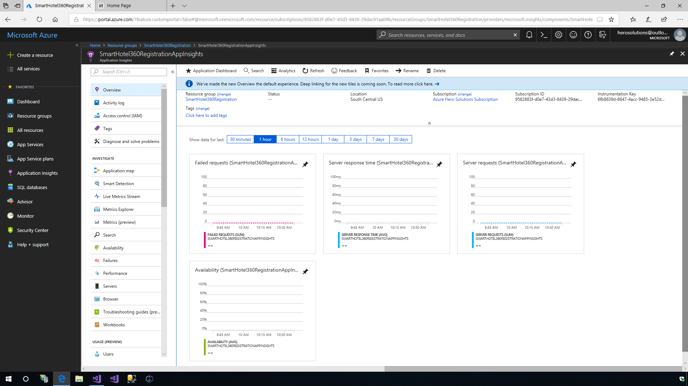
    

### Exercise 5: Snapshot Debugger for .NET

1. Right-click on the web project and select the **Manage NuGet Package** option. Type **Microsoft.ApplicationInsights.SnapshotCollector** under the **Browse** tab and click on the *Install* option to include it in our web project.


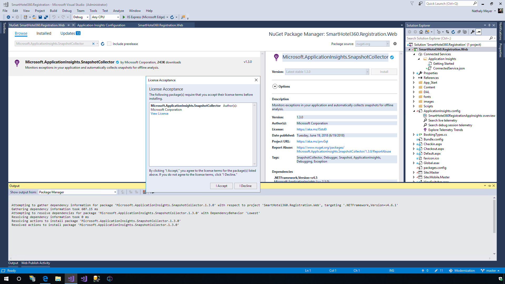
    

     > **Talk Track**: Debugging apps can be difficult especially if the app is running on production. With the Snapshot Debugger, we can take a snapshot of our in-production apps. The debugger lets us see exactly what went wrong, without impacting traffic of our production application. The Snapshot Debugger can help us dramatically reduce the time taken to resolve issues that occur in production environments.

1. Let us introduce a bug in the code. Open the file **Checkin.aspx.cs**, comment the **line 19** and uncomment **line 20**. So, the code will look like this:

    ```
    //int.TryParse(Request.QueryString["registration"], out int registrationId);
    int.TryParse(Request.QueryString["registrationId"], out int registrationId);
    ```

   This will throw an ArgumentException in the line 23, so a new exception will be stored in the Application Insights and we will be able to download the snapshot for that exception.


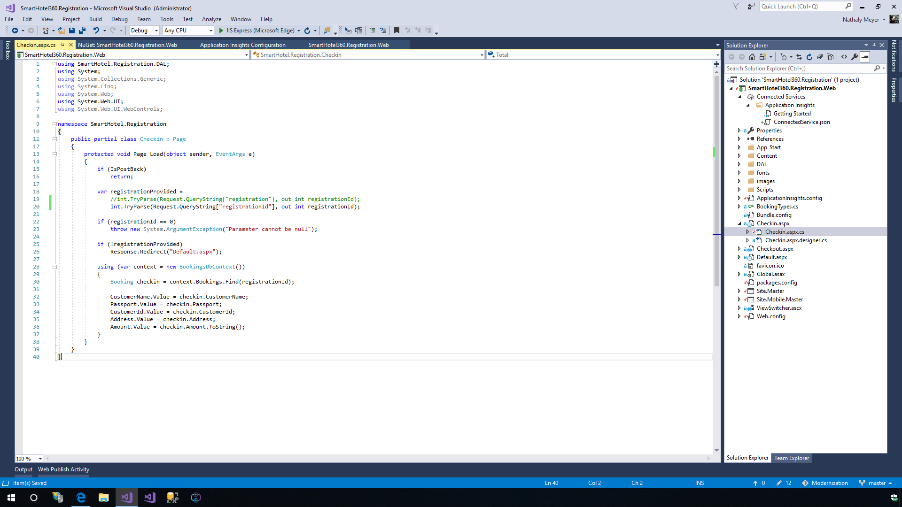
    

1. Let us re-publish the web project with the profile created. Once the website is running, click on the **CheckIn** option in the web page and notice the ArgumentException exception for the error that we just created.


    

1. In the Application Insights Service in Azure Portal, navigate to the **Failures** and open the exception with the error **System.ArgumentException**.


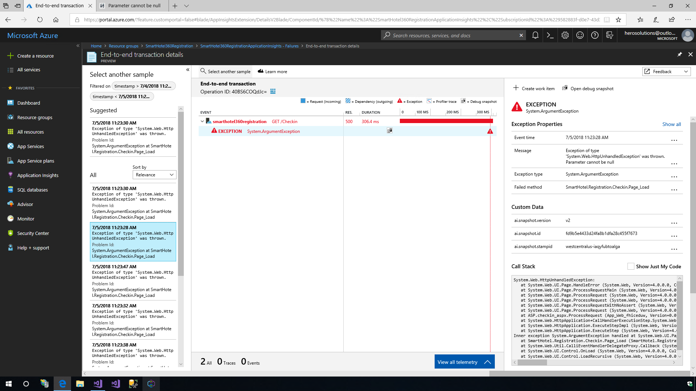
    

    >**Talk Track**: Here, we can track all the metrics associated with our app, including failures and performance availability. We can also configure alerts, work items, and more. Let us review the exceptions.

1. Click the **Open debug snapshot** option and then click on the **Download Snapshot** option.


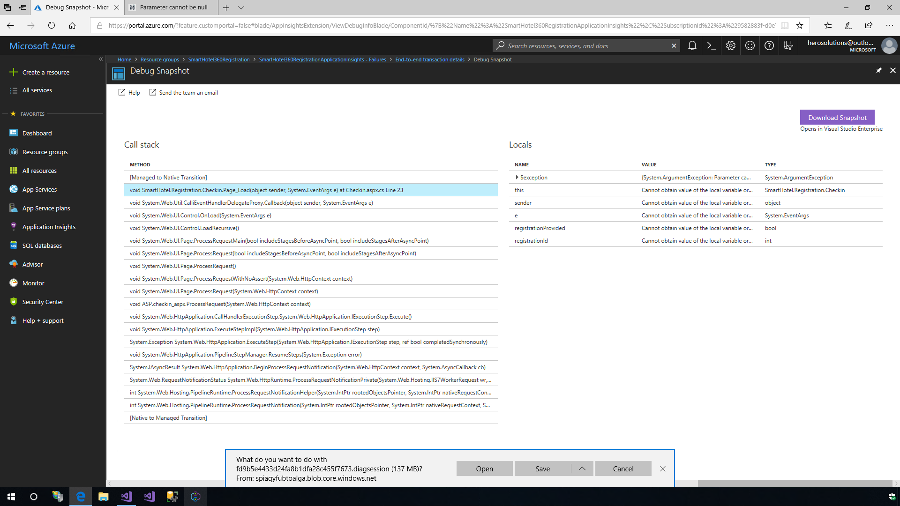
    

1. Open **Visual Studio Enterprise 2017** and open the solution **SmartHotel360.Registration**. Open the file that was downloaded and then click on the **Debug with Managed Only** option. This will set the Visual Studio in debug mode and then click the **Continue Debugging** option to see when the Argument Exception was thrown.


    

   > **Talk Track**: The snapshot or the dump file, contains both Snappoints and Logpoints. We can use **Snappoints** and **Logpoints** to make it easy to debug in production. Snappoints are like breakpoints that allow us to take snapshots of a system when a given line is executed, but without noticeably pausing the execution of the application. Logpoints work in the same way, except that they allow us to inject custom logging into production apps on the fly.

1. Use the **Cloud Explorer** and navigate to the App Services in Azure. Right-click on the website and select the **create a snappoint** option which will debug the App Services remotely without affecting its runtime. However, we may need to reset the App Service to enable the snappoint.


    

## Scenario 2: Publishing a WCF Service in Azure App Service

The Azure App Services also provide support for most of the WCF services. To demonstrate this, we are going to show the second scenario which includes a WCF service with HttpBinding connected to a SQL Server Database. To deploy this, we will need another App Service for the WCF service. In this case, we can use the same App Service Plan that we already have for our website.

1. Open the solution called **SmartHotel.Registration.Dependency** located on the desktop. Right-click on the WCF project and select the **Publish** option. In the **App Service** option, click on the **Create New** option and then click the **Publish** option. To create an App Service, we can select the existing Resource Group and the Hosting Plan and then click on the **Create** button.


    

1. Once the profile is created and the WCF is published to the App Service, we need to go back to the Visual Studio and click on the **Configure** option to change the connection string of the database. Click the **Next** button and then click on the ellipsis button of **DefaultConnection**. Specify the Server name, select the SQL server authentication, enter the credentials and select the database name created in the **Exercise 2 Step 4**. Click on the **Test Connection** button to make sure it is able to connect. Click on the **Save** button and then click on the **Publish** button again.


    

1. Before publishing the web project, we need to change the URL of the WCF. Open the **web.config** file from the web project (SmartHotel360.Registration.Web) and paste the new URL and append **/Service.svc** in the **line 55** and save the file.


    

1. Right-click on the web project and select the **Publish** option in the App Service menu. Use the option **Select Existing** and then click on the **Publish** option. Select the App Service we created in the **Exercise 2 Step 3** and then click on the **OK** button.


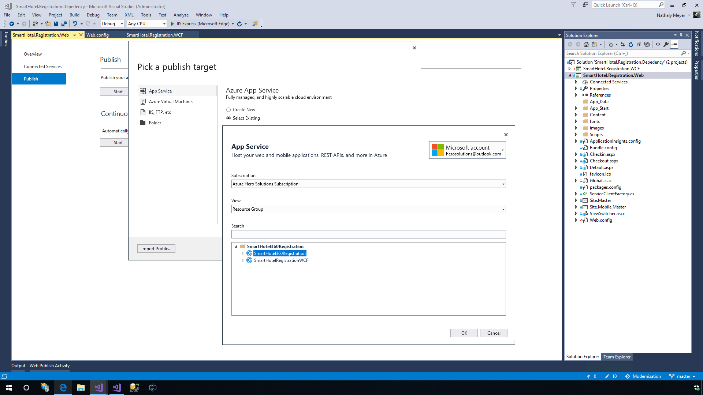
    


    

## Scenario 3: Hybrid Connection - Web App in Azure with WCF Service and database hosted on-premise

One of the biggest advantages of App Service is the option to use Virtual Networks or Hybrid Connections to communicate with resources running on-premise.

For the third scenario, we cannot move the service and database yet because other on-premises applications have a dependency. In this case, SmartHotel360 wants to move their website to Azure but not their WCF Service and database.

1. In the web project, we need to change back the URL of the WCF service in the **Web.config** file in the **line 55** and point it to URL http://localhost:2901, where we have hosted our on-premise WCF service.

   <p align="center">

    

1. Save the file and re-publish the web project with the same profile we used in the previous scenario. We will get an error because the website will not be able to connect to the WCF services in the local IIS server.

   <p align="center">

    

1. To solve this, let us use the **Hybrid Connection**. Navigate to the App Service and click on the **Networking** option under Settings. Click on the **Configure your hybrid connection endpoints**. We can download the Hybrid Connection Manager but in this VM we already have it installed. So, let us click on the **Add hybrid connection** option, then select the **Create new hybrid connection** option. Provide the Hybrid Connection Name, Endpoint Host, Endpoint Port and Create or Select a namespace. In this case, we want to connect to the localhost with the port 2901 and create a new namespace.

   <p align="center">
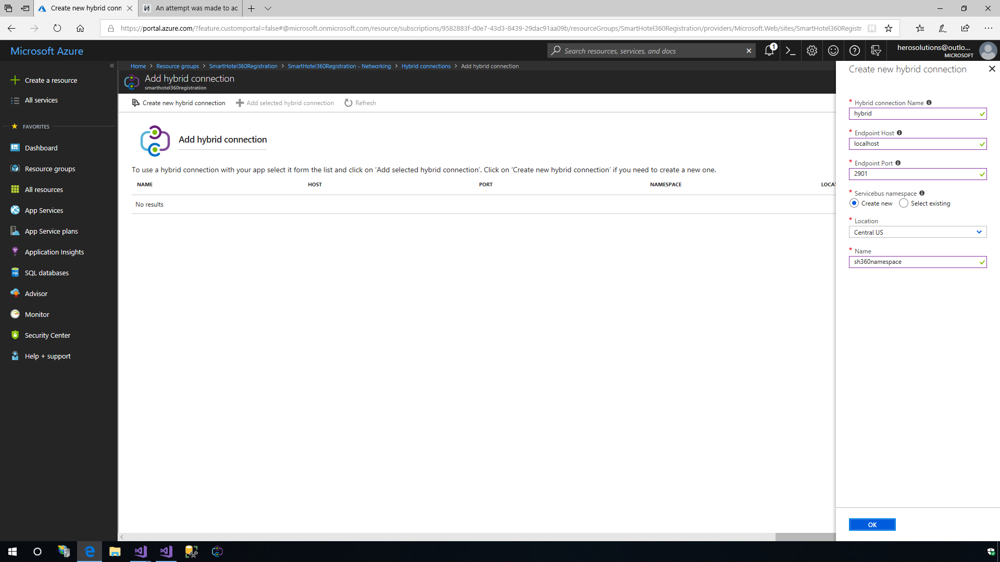
    

1. Once the connection is registered, open the **Hybrid Connection Manager** tool and login with the Azure credentials to get access to registered hybrid connections in our Azure subscription.

1. Choose the subscription, select the connection that was just registered and click on the **Save** button. Click on the **Refresh** option in the Azure Portal Hybrid Connections and notice that the connection is active from the Azure side.

   <p align="center">

    

1. Refresh the website and now it would be connected to the WCF service in the localhost through the Hybrid Connection of the App Service.

   <p align="center">
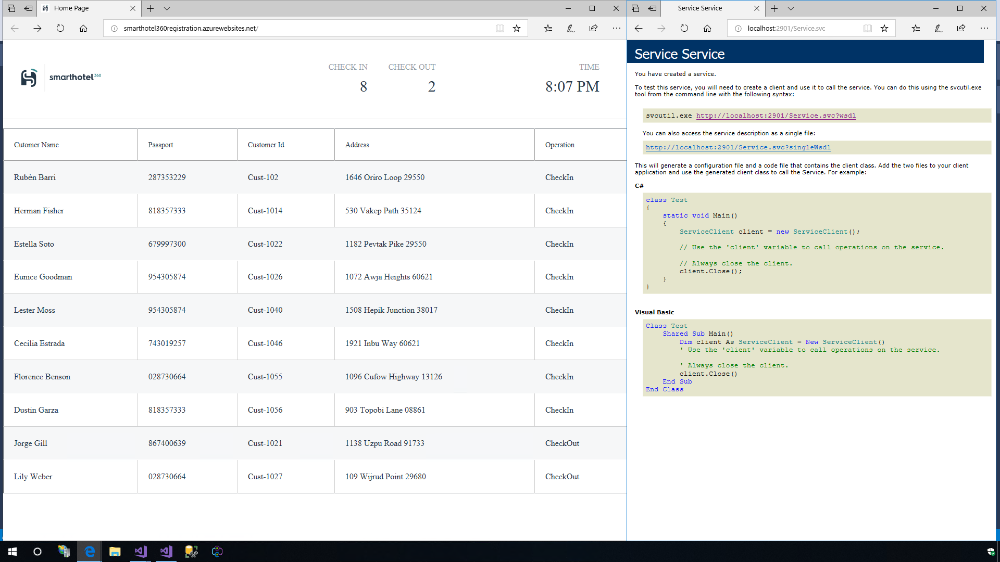
    

   >**Talk Track**: We have just seen how Microsoft Azure App Service can help us quickly build modern web, mobile and API apps for any platform, in any language; meet rigorous performance, scalability, security and compliance requirements; and leverage a fully managed platform to perform infrastructure maintenance.

## Summary

Azure App Service enables us to modernize our app portfolio in a very easy and painless way. We can build and host web applications in the programming language of our choice without managing the infrastructure. It offers auto-scaling and high availability, supports both Windows and Linux, and enables automated deployments from GitHub, Visual Studio Team Services or any other repositories. Get started [here with Azure App Service](https://azure.microsoft.com/services/app-service).

## Feedback

Thank you for taking the time to follow the demo. Your feedback is greatly appreciated in order to ensure that we provide more labs. Please share your inputs via email on [Azure App Dev Demos](mailto:azureappdevpstdemos@microsoft.com).
